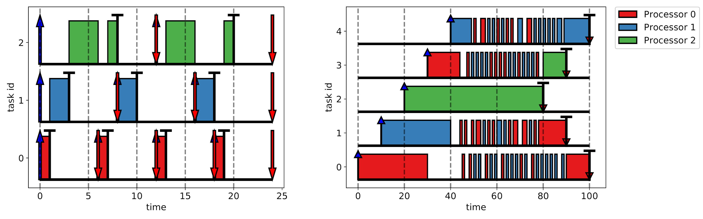

# real-time-simulator

This repository contains a simulator written to analyze the effectiveness of
various real-time scheduling policies in the presence of CPU overhead.

A written report on the simulator and several experiments can be read
[here](report/Report.pdf). 